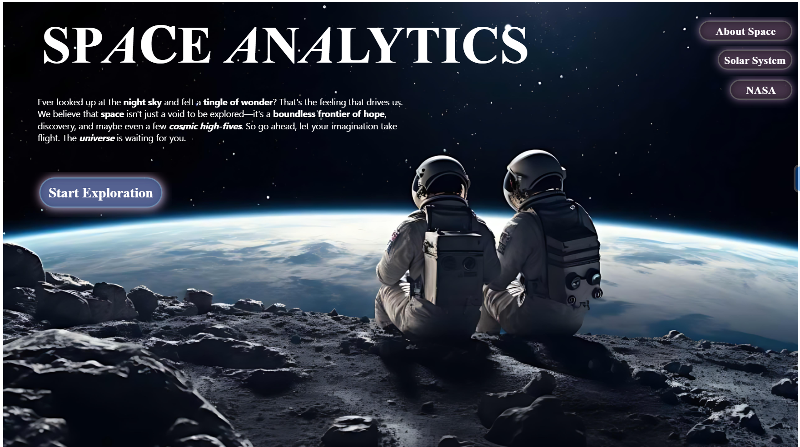
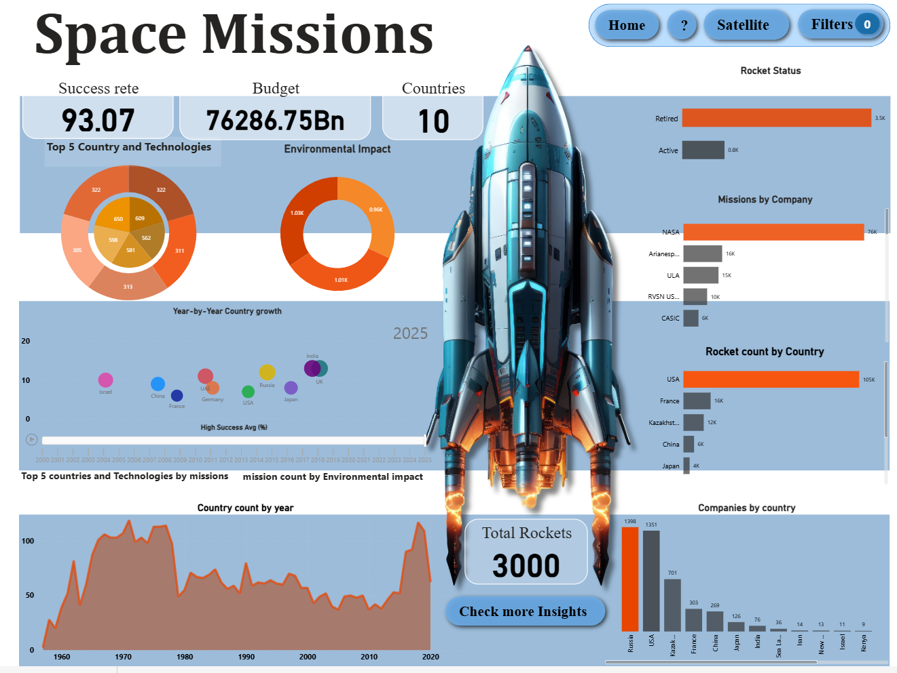
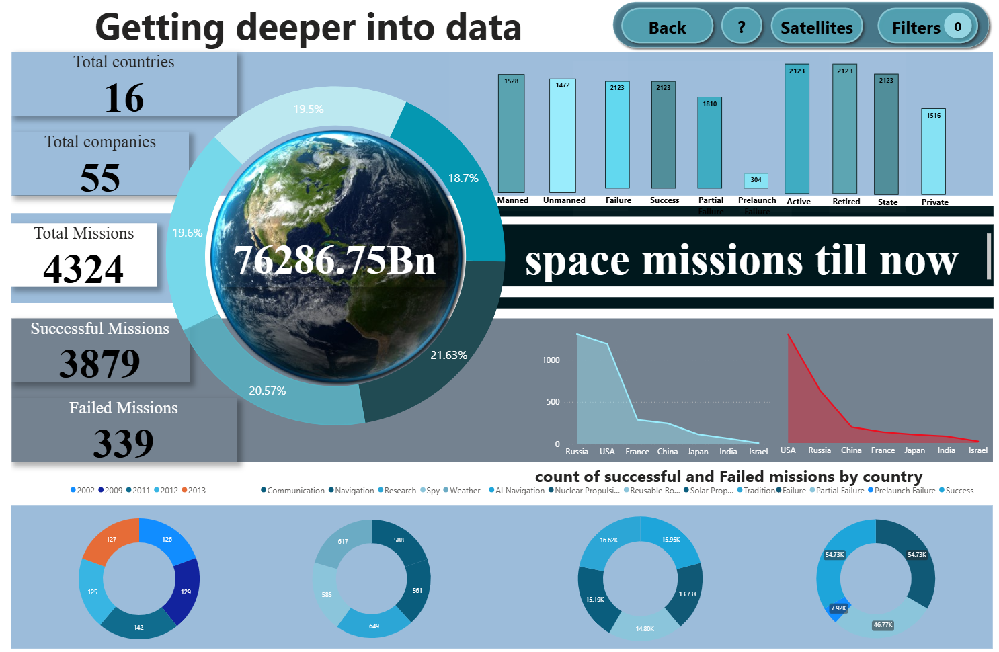
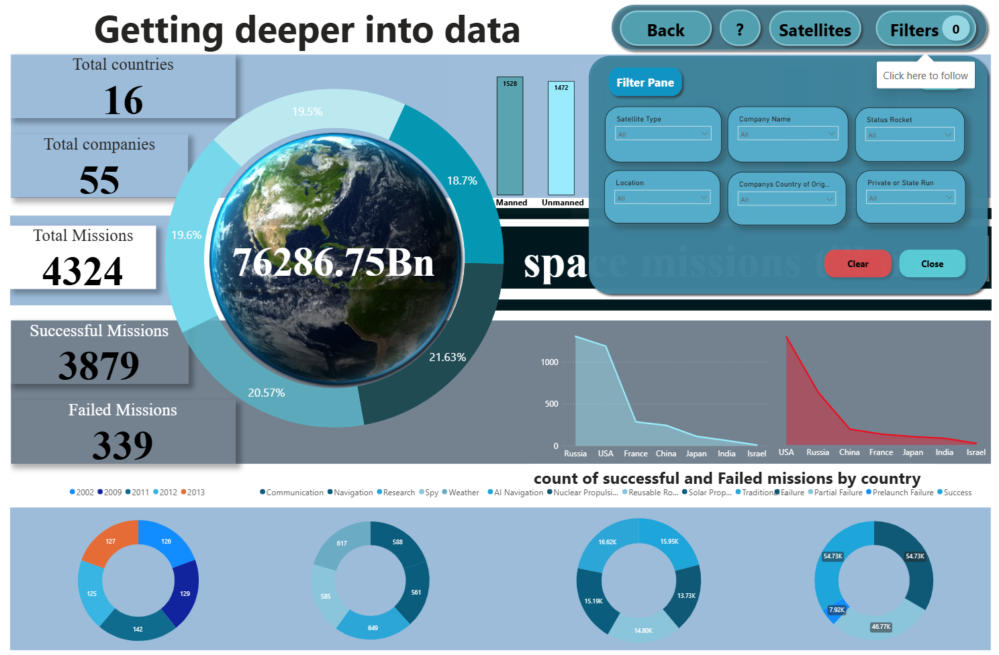
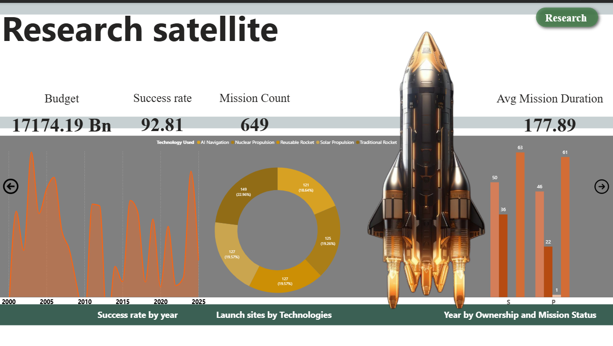
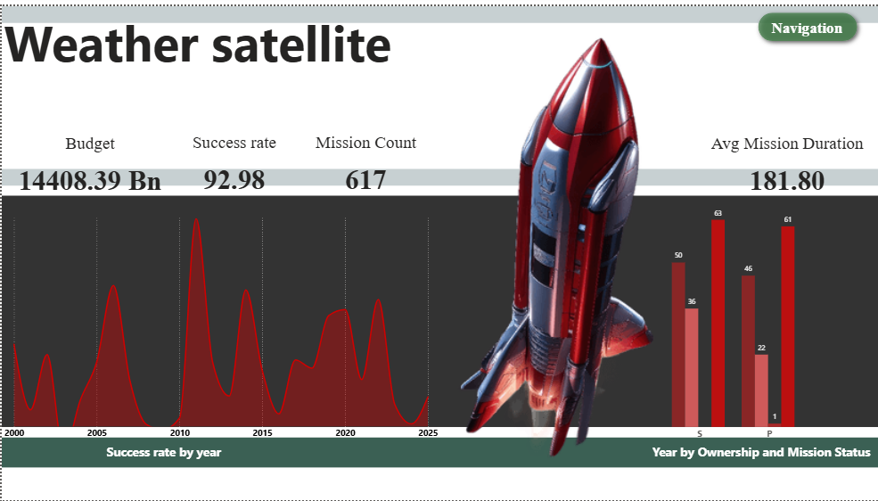
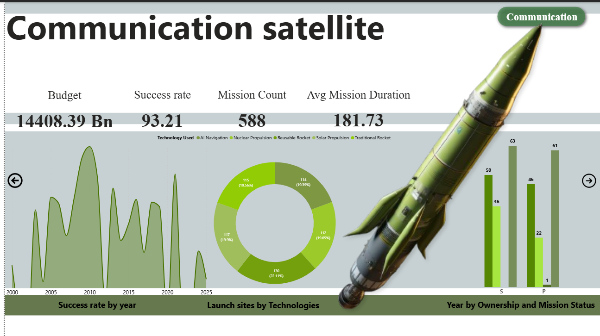
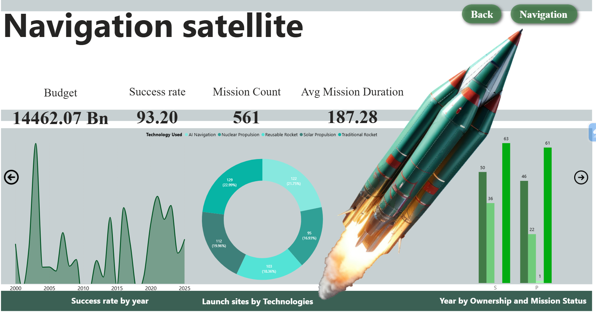

# 🚀 Global Aerospace Sector: Operational & Financial Performance Suite

### **Project Overview**
This project presents a multi-dimensional analysis of global space exploration data from 1957 to the present. Using **Power BI**, I architected an interactive intelligence suite that tracks mission success rates, budgetary allocations across nations, and the technological evolution of rocket propulsion.

---

## 📈 Executive Strategic Insights
* **Budgetary Efficiency:** Analyzed a total global expenditure of **$76,286 Billion**, identifying that high-budget missions do not always correlate with higher success rates, suggesting a need for optimized resource allocation.
* **Technological Shift:** Visualized the transition from traditional rocket systems to **AI-Navigation** and **Reusable Rocket** technologies, which have significantly increased mission frequency since 2010.
* **National Leadership:** Quantified the dominance of the **USA and Russia** in total rocket counts, while identifying **India and France** as emerging leaders in high-success-rate commercial satellite deployment.

---

## 🏗️ Dashboard Architecture

### 1. Landing Experience (The "Vision" Page)
Designed an immersive entry point for stakeholders to define the scope of the aerospace exploration.

### 2. Global Mission Overview
A 360-degree view of 4,300+ missions, detailing success vs. failure ratios and country-wise growth trends.

### 3. Deep-Dive Analytics & Data Filtering
Integrated a complex **Filter Pane** allowing users to slice data by Satellite Type, Location, and Ownership (Private vs. State-Run).

### 4. Specialized Satellite Analysis
Dedicated sub-dashboards analyzing performance metrics for specific mission categories:
* **Research Satellites:** Focusing on mission duration and AI integration.
* **Weather Satellites:** Analyzing success rates and navigation technologies.
* **Communication Satellites:** Tracking ownership status and launch site efficiency.

| Research | Weather | Communication | Navigation |
| :---: | :---: | :---: | :---: |
|  |  |  |  |

---

## 🏗️ Technical Execution Details
* **Data Modeling:** Transformed raw aerospace datasets into a star schema for optimized Power BI performance.
* **Custom DAX Measures:** Developed sophisticated DAX formulas to calculate **Dynamic Success Rates** and **Year-over-Year (YoY) Growth** per country.
* **UI/UX Design:** Implemented a custom "Space Theme" with navigation buttons and synchronized slicers for a seamless user experience.

---

## 🛠️ Performance Metrics Summary
| Metric | Value |
| :--- | :--- |
| **Total Missions Processed** | 4,324 |
| **Global Success Rate** | 93.07% |
| **Total Countries Analyzed** | 16 |
| **Total Active Companies** | 55 |

---

## 📂 Repository Structure
* `/screenshot`: High-resolution dashboard exports.
* `/data`: Source datasets (Space Missions).
* `Space_mission_analysis_Final.pbix`: The master Power BI analytical file.

---

> **Consultant Note:** > This project demonstrates the ability to handle large-scale global datasets and translate complex engineering milestones into strategic business intelligence. It is designed to assist C-suite stakeholders in the aerospace sector with data-driven decision-making.
